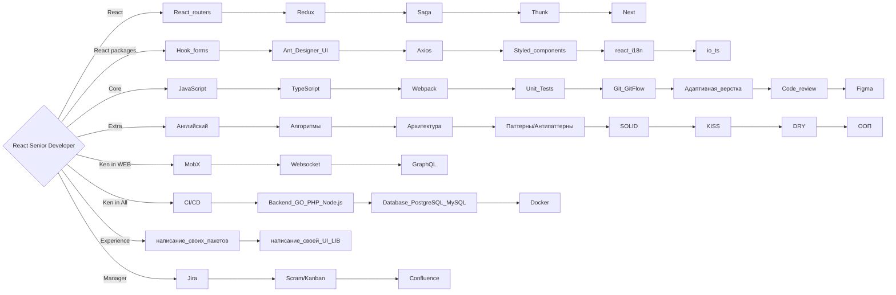

# React-helper


# Схема роста



## Оглавление
1. [React](#React)
2. [Частые кейсы](#Частые-кейсы)
3. [Vanilla JS](#Vanilla-JS)
4. [Учебные ресурсы](#Учебные-ресурсы)
5. [Полезные библиотеки для React](#Полезные-библиотеки-для-React)
6. [Определения](#Определения)
7. [Правила коммитов](#Правила-коммитов)


## Определения
- Паттерны - https://htmlacademy.ru/blog/js/patterns
- Абстракция
- Карирование
- Имутабельность
- Инкапсуляция
- Декларативный подход
- императивный подход
- мемомизация 
```md
Мемоизация (Кеш) (англ. memoization от англ. memory и англ. optimization) — пример использования кеша при 
разработке программного обеспечения, в программировании сохранение результатов выполнения функций для предотвращения 
повторных вычислений. 
Это один из способов оптимизации, применяемый для увеличения скорости выполнения компьютерных программ. 

Перед вызовом функции проверяется, вызывалась ли функция ранее:
- если не вызывалась, то функция вызывается, и результат её выполнения сохраняется;
- если вызывалась, то используется сохранённый результат.

Мемоизация может использоваться не только для увеличения скорости работы программы.
Например, она используется при взаимно-рекурсивном нисходящем синтаксическом разборе в обобщённом алгоритме нисходящего
синтаксического анализа.
Несмотря на связь с кешированием, мемоизация является особым видом оптимизации, отличающимся от таких способов кеширования,
как буферизация и подмена страниц.
```

- композиция

## React
Хуки (сделать подробное описание, промеры + код пен и возможно сравнение со вью
Посмотреть, может каких то хуков не хватает

- useState ( слежка-реактивности за данными, get и set)

- useEffect ( можно использовать как wathcer, и хук onMaunt)

- useCallback ( при создание компонента по новой, функция передается по ссылке, а не создается заново)

- useMemo ( кеширует и вычеслительные действия, например computed)

- useRef ( вместо querySelector)

- useReducer ( мини redux, состояние приложения)

- useContext ( provide, inject - можно с родителя передать в глубь необходимые данные без лишних props)

- useLayoutEffect ( срабатывает до монтирования в дом)

- useImperativeHande - необходимо использовать ref + forwardRef и можно получить элемент в другом компоненте и обновлять его из другого компонента

- cuatomHook react ( можно создать свои хуки используя, встроенные и так же можно создавать хуки и в них использовать свои, что создал) - вынесение логки
- 

## Частые кейсы
1. как передать данные из родителя в дочерний компонент (данные и событие) - https://stackblitz.com/edit/emit-in-parent?file=App.tsx
2. как передать из дочернего компонента в родитель данные стейта или событие - не делал
3. Условный рендер с логическим оператором && и тернарный рендер - https://stackblitz.com/edit/react-ts-jc9rpv?file=App.tsx


## Vanilla JS

- Event Loop
- Функции высшего порядка - https://habr.com/ru/company/ruvds/blog/428570/
```md
Функции высшего порядка — это функции, которые работают с другими функциями,
либо принимая их в виде параметров, либо возвращая их. Проще говоря, 
функцией высшего порядка называется такая функция, которая принимает функцию как аргумент или возвращает 
функцию в виде выходного значения.
```
- что такое callback - https://htmlacademy.ru/blog/js/callback-functions
- promise
- get,set
- рекурсия
- декораторы
- деструкторизация
- call, apply, bind
- this
- window
- spread
- тернарный оператор
- импортирование и экспорт файлов
- ссылочный тип и примитивные типы

## Учебные ресурсы
1. https://metanit.com/web/react/ - Metanit
2. https://ru.reactjs.org/ - ru React Docs
3. https://beta.reactjs.org/ - en React Docs new - function structure

## Полезные библиотеки для React
1. Yup - валидация
2. react hook forms
3. react
4. nano store
5. react routers
6. redux


spread

```js
1. У нас есть один массив const a = [1, 2, 3] который мы хотим модифицировать, добавив несколько значений:

const a = [1, 2, 3];
const b = [...a, 4, 5, 6]; // [1, 2, 3, 4, 5, 6]

Теперь у нас новый массив b который содержит все значения a, плюс свои.

2. Также можно создать копию массива:
const c = [...a];

3. spread также работает и для объектов. Клонировать объект можно так:
const newObj = { ...oldObj };

4. Используя строки, оператор распространения spread создает массив с каждым символом в строке:
const hey = "hey";
const arrayized = [...hey]; // ['h', 'e', 'y']

5. У этого оператора есть несколько довольно полезных свойств.
Наиболее важным из них является возможность очень просто использовать массив в качестве аргумента функции:

const f = (one, two) => {
  console.log(one, two); // 1, 2
};
const a = [1, 2];
f(...a);
```


Матчить - это https://habr.com/ru/company/sberbank/blog/354564/
иммутабельность - В программировании неизменяемым (англ. immutable) называется объект, состояние которого не может быть изменено после создания.

В функциональном программировании все (в случае чистых языков) или почти все (в случае «нечистых» — англ. impure — языков) данные в программе, как локальные, так и глобальные, являются неизменяемыми. С одной стороны, это существенно повышает стабильность программ за счёт упрощения формальной верификации программ. С другой, это затрудняет решение ряда задач (из которых наиболее часто отмечается задача реализации интерфейса пользователя, который в своей сути представляет собой изменяемое состояние), что вынуждает усложнять системы типов языка — например, монадами или уникальными типами.

https://formik.org/  - для работы с формами - наподобие react hook forms

update useState
чтобы получать стейт актуальный обновленный - setData((data) => data+2) - функция должна быть чистая, без сайдэффектов

## Задачники Code Wars / Leet Code

## Правила коммитов в Git

пример- (git commit -m "feat: number task - description commit):
- build - Изменения, влияющие на систему сборки или внешние зависимости (webpack, npm, gulp)
- ci - Изменения в конфигурационных файлах и сценариях CI
- docs - Меняется только документация
- feat - Новый функционал
- fix - Исправление бага
- perf - Изменение кода, повышающее производительность
- refactor - Изменение кода, которое не исправляет ошибку и не добавляет новую функцию.
- revert - Откат изменений
- style - Изменения кодстайла (табы, отступы, точки, запяты и тд.)
- test - Изменения касающиеся тестов
- chore - Все, что не подходит по типы выше
